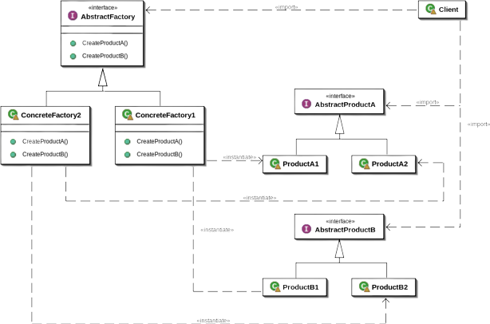

## Abstract Factory Design Pattern

## [Implementation](./Implementation/IBuilder.cs) And [How To Use](./UseAbstractFactory.cs)

### **`GOF:`**

یک اینترفیس اراعه میدهد برای ساخت خانواده ابجکت مرتبط یا وابسته بدون مشخص کردن کلاس عینی ان

### **`Concept:`**

*Factory Of Factories.*

این پترن روشی برای کپسوله سازی یک گروه از فکتوری ها با پس زمینه مشترک اراعه میدهد

(کپسوله سازی/encapsulation/همه رو در یک گروه یا محفظه قرار دادن)

در این روش شما مستقیما از کلاسی نمونه سازی نمیکنید در عوض از یک فکتوریه عینی برای ساخت کلاس استفاده میکنید

**تصور کنید:**

میخواهید برای اتاقتون میز تهیه کنید

یک میز چوبی و یک میز فلزی

قاعدتا برای میز چوبی به نجاری میرید و برای میز فلزی به پیش یک اهنگر میروید

هردوی انها درواقع یک کارخانه میز سازی هستند ولی شما انتخاب میکنید که پیش کدوم برید

(کارخانه/factory/محل ساخت یک وسیله/..etc)

# FAQ 

**`> FactoryProvider`**

ساخت این کلاس الزامی نیست و میتونید مستقیم از فکتوری هاتون استفاده کنید

##

**> سختی های استفاده از این پترن**

هر تعقیر در 
`abstract factory`

شمارو مجاب به تعقیر سایر فکتوری ها میکنه

یکی از مهمترین کلید های این پترن 

*Program an Interface, But Not To An Implementation*